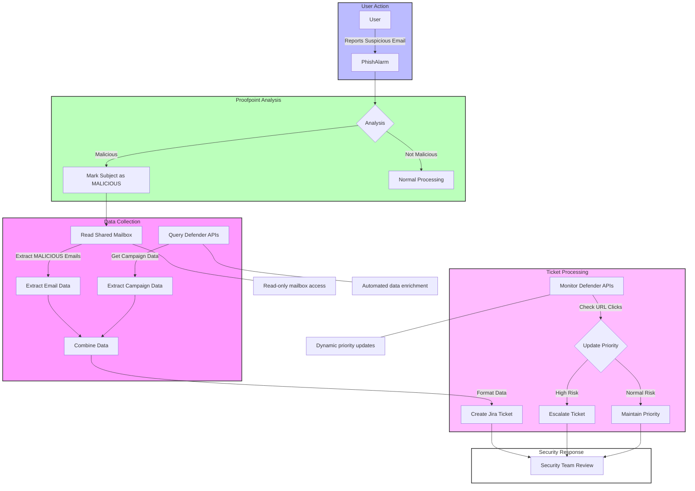

```mermaid
flowchart TB
    subgraph UserAction["User Action"]
        A[User] -->|Reports Suspicious Email| B[PhishAlarm]
    end

    subgraph ProofPoint["Proofpoint Analysis"]
        B --> C{Analysis}
        C -->|Malicious| D[Mark Subject as MALICIOUS]
        C -->|Not Malicious| E[Normal Processing]
    end

    subgraph DataCollection["Data Collection"]
        D --> F[Read Shared Mailbox]
        F -->|Extract MALICIOUS Emails| G[Extract Email Data]
        H[Query Defender APIs] -->|Get Campaign Data| I[Extract Campaign Data]
        G --> J[Combine Data]
        I --> J
    end

    subgraph TicketCreation["Ticket Processing"]
        J -->|Format Data| K[Create Jira Ticket]
        L[Monitor Defender APIs] -->|Check URL Clicks| M{Update Priority}
        M -->|High Risk| N[Escalate Ticket]
        M -->|Normal Risk| O[Maintain Priority]
    end

    subgraph SecurityTeam["Security Response"]
        K --> P[Security Team Review]
        N --> P
        O --> P
    end

    style UserAction fill:#bbf,stroke:#333,stroke-width:2px
    style ProofPoint fill:#bfb,stroke:#333,stroke-width:2px
    style DataCollection fill:#f9f,stroke:#333,stroke-width:2px
    style TicketCreation fill:#fbf,stroke:#333,stroke-width:2px
    style SecurityTeam fill:#fff,stroke:#333,stroke-width:2px

    %% Add clarifying notes
    classDef note fill:#fff,stroke:#333,stroke-width:1px,stroke-dasharray: 5 5
    class Note note

    Note1[Read-only mailbox access]
    Note2[Automated data enrichment]
    Note3[Dynamic priority updates]

    F --- Note1
    H --- Note2
    L --- Note3

```